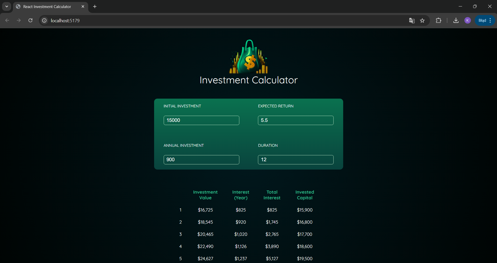
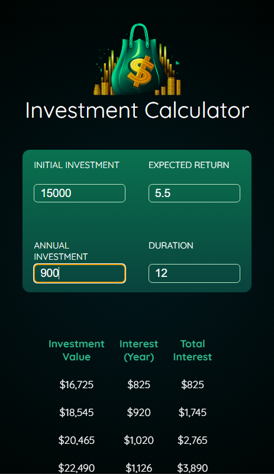

# **⚛Investment Calculator**

**Investment Calculator** to aplikacja internetowa pozwalająca użytkownikom obliczać potencjalne zyski z inwestycji na podstawie wprowadzonych danych.

**Screnshots**
Desktop:


Mobile:


## **📌 Funkcjonalności**
* **Obliczanie** końcowej wartości inwestycji na podstawie początkowego kapitału, rocznego oprocentowania, długości inwestycji i dodatkowych wpłat.
* **Wyświetlanie** wyników w tabeli.
* **Przejrzysty** i intuicyjny interfejs użytkownika.
* **Dynamiczne** aktualizowanie wyników w oparciu o dane wejściowe.

## **🛠 Technologie**
* **React** – biblioteka do budowy interfejsu użytkownika.
* **CSS** – stylowanie aplikacji.
* **JavaScript (ES6+)** – logika aplikacji


## **🚀 Uruchomienie**
1. **Zainstaluj zależności**:
   ```sh
   npm install

2. **Uruchom aplikację**
   ```sh
   npm start
3. **Otwórz w przeglądarce**:
Wyswietlony: htttp://localhost:{PORT}